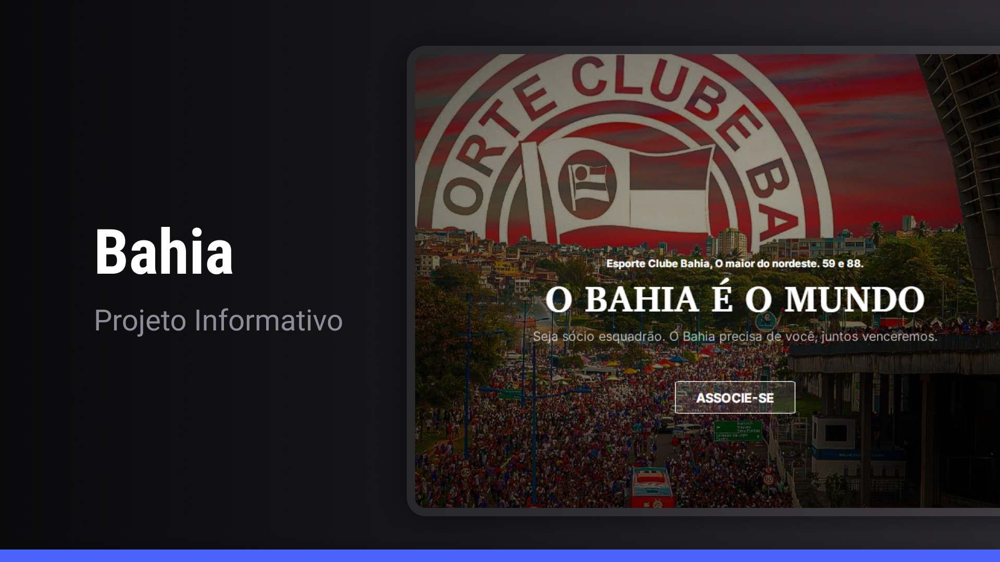

<h1 align="center"> Projeto Bahia </h1>

Projeto feito por Thiago Menezes, baseado no projeto promovido pela Rocketseat para ensino de tecnologias WEB.

  <a href="#-tecnologias">Tecnologias</a>&nbsp;&nbsp;&nbsp;|&nbsp;&nbsp;&nbsp;
  <a href="#-projeto">Projeto</a>&nbsp;&nbsp;&nbsp;&nbsp;&nbsp;&nbsp;

  

 

  

## 🚀 Tecnologias

Esse projeto foi desenvolvido com as seguintes tecnologias:

- HTML e CSS
- Figma
- Git e Github

## 💻 Projeto
  O projeto é para ser ultilizado como marketing para influenciar as pessoas a ser sócio do Bahia.

---

Feito com ♥ por Thiago Menezes.
